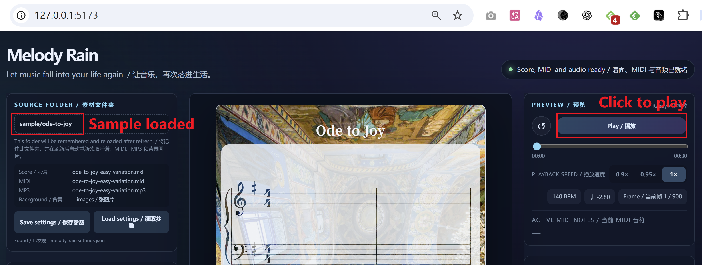

# MelodyRain

[简体中文](./README.zh.md) | [English](./README.md)

MelodyRain is a local-first animated sheet-music application. It reads MusicXML/MXL, MIDI, and MP3 files, then uses a single timeline to drive audio playback, score scrolling, falling notes, and hit effects. Score and performance elements can also reveal a shared background image or color through masks.

The current version supports portrait-format previews in the browser and local MP4 video export.

## How Codex & GPT-5.6 were used

GPT-5.6, accessed through Codex, was the primary AI model used throughout the creation of Melody Rain. It helped turn the initial emotional concept into the product and technical specification, draft and maintain the README, design the architecture, generate and refactor the React, TypeScript, SCSS, Express, Playwright, and FFmpeg code, write tests, diagnose bugs, and iterate on synchronization, animation, UI, and export behavior. GPT-5.6 was used as a development collaborator across the project rather than as a model embedded in Melody Rain at runtime; the application itself does not currently call the OpenAI API while a user previews or exports a performance.

## Features

- Renders SVG sheet music with OpenSheetMusicDisplay;
- Automatically matches MXL/MusicXML, MIDI, and MP3 files with the same base name in an asset folder;
- Supports play, pause, rewind, seeking, and `0.9×`, `0.95×`, and `1×` playback speeds;
- Displays the current absolute export-timeline frame during preview, and deterministically renders selectable frame ranges with local Chrome into 30 FPS H.264/AAC MP4 through FFmpeg, with standard/high quality, progress, and cancellation;
- Animates notes, chords, rests, and related notation as they fall, hit, and settle onto the score;
- Uses a three-phase vertical camera: stationary until the active score row reaches the screen midpoint, then smoothly follows that row near the vertical center, and stops early once the complete score ending is visible;
- Uses a fixed image or solid color as the score mask source, with adjustable black mixing and paper transparency;
- Offers shared-mask and C–B rainbow styles for performance elements;
- Lets beamed note groups fall together or expand left to right after the first note lands;
- Supports automatic high-contrast or custom title colors;
- Allows 1–6 measures per system;
- Saves project parameters to `melody-rain.settings.json` and restores them when the asset folder is loaded again.

## Video Export

The local Express service creates an export job. Playwright drives an installed Chrome or Edge browser to render deterministic frames from absolute timeline times, then pipes PNG frames to FFmpeg and muxes them with the supplied MP3 as an H.264/AAC MP4. Preview and export share the same Transport, score camera, and animation-state calculations.

- Standard quality defaults to `540 × 960` at 30 FPS with a faster encoder preset;
- High quality outputs `1080 × 1920` at 30 FPS;
- Full-song export remains the default, while an optional half-open frame range includes the start frame and excludes the end frame; frame numbers include the 1.2-second entrance pre-roll, so frame 36 is source time zero;
- Full-score export with a 1.2-second falling-note pre-roll;
- Progress, cancellation, and error reporting; the server enforces a concurrency limit and validates the Origin header;
- Audio sync uses the FFmpeg `adelay` filter to pad real silence, avoiding A/V drift on mobile players that ignore the MP4 edit list;
- The current display title is the default filename, with Windows-invalid filename characters replaced automatically;
- The result is written directly to the authorized asset folder when possible, with browser download as a fallback;
- A completion dialog reports the filename and save method.

Development exports require `npm run dev`, which starts both Vite and the local export service. Running only `npm run dev:web` leaves the export API unavailable.

When no project settings file is loaded, the visual defaults are `40%` score-mask black mixing, `10%` paper transparency, and `50%` performance-mask color mixing.

## Requirements

- Node.js `>=20.19 <27`
- npm
- FFmpeg available as `ffmpeg` on the system `PATH`
- A recent version of Chrome or Edge is recommended. When the File System Access API is available, MelodyRain can remember the asset folder and write settings directly into it. Other browsers fall back to folder selection and JSON downloads.

## Quick Start

Install dependencies and start the development servers:

```powershell
npm install
npm run dev
```

Open <http://127.0.0.1:5173>. The Vite development server proxies `/api` requests to the local Express service at `127.0.0.1:4174`.

The application should already load the sample "ode-to-joy", and you can just click "Play" to start playback. If the sample is not loaded, click **选择素材文件夹** (Select Asset Folder) and choose this directory from the repository:

```text
sample/ode-to-joy
```



The sample contains:

```text
ode-to-joy-easy-variation.mxl
ode-to-joy-easy-variation.mid
ode-to-joy-easy-variation.mp3
ode-to-joy-easy-variation.pdf
melody-rain.settings.json
```

MelodyRain uses the first three files with matching base names to build the project and automatically loads the settings file. The PDF is included only as a reference and is not read by the application. The sample settings use a solid-color background, two measures per system, and rainbow-colored performance elements.

Once parsing and layout are complete, the status changes to **Score, MIDI, and audio are ready / 谱面、MIDI 与音频已就绪**, and playback can begin.

## Preparing Your Own Assets

An asset folder must contain at least:

- One score: `.mxl`, `.musicxml`, or `.xml`;
- One MIDI file: `.mid` or `.midi`;
- One audio file: `.mp3`.

Using the same base name for all three files is recommended:

```text
my-song.mxl
my-song.mid
my-song.mp3
```

You may also include `.png`, `.jpg`, `.jpeg`, `.webp`, or `.avif` background images and one `melody-rain.settings.json` file. If there is exactly one candidate for each required asset type, the files can still be loaded when their names differ. If the folder contains multiple groups that cannot be matched unambiguously, MelodyRain stops and reports an error.

The MusicXML, MIDI, and MP3 should come from the same score and export. Otherwise, note animations may not align correctly with the audio.

## Saving and Loading Settings

The **保存参数** (Save Settings) action stores:

- Title, title color, and automatic/custom color mode;
- Measures per system;
- Background mode, color, or image filename;
- Score-mask black mixing and paper transparency;
- Performance-effect mode, mix color, and mix strength.
- Connected-note mode;
- Frame-range coloring with a 60-frame transition and custom ranges.

**NOTE FRAME EFFECT / 音符帧效果** manages one shared mix strength and frame-range coloring. On first load it creates `Range 1` from frame 1 through the final frame. Solid ranges use the shared score background source with a color overlay at the selected strength; rainbow ranges ignore strength. When a range ends or ranges have a gap, the most recent range setting continues until another range takes over or the video ends. All color boundaries interpolate smoothly over 60 frames from absolute frame numbers, including solid/rainbow mode switches, which cross-fade through the rainbow renderer before settling on the final renderer.

The filename is always `melody-rain.settings.json`. If the browser has write access to the asset folder, the file is saved there directly. Otherwise, the browser downloads it and you must move it into the asset folder manually. Use **读取参数** (Load Settings) to reapply the detected settings file or choose another JSON file.

The current development format is v5 and only the current version is accepted. `sample/ode-to-joy/melody-rain.settings.json` is the complete editable default and contains readable `noteFrameEffect` strength and at least one range starting at frame 1.

On first startup, when no user media folder has been remembered, MelodyRain automatically loads `sample/ode-to-joy`, including its score, MIDI, MP3, background, and default settings. Once the user selects and authorizes a media folder, later refreshes restore that folder instead of replacing it with the sample.

## Production Build

```powershell
npm run build
npm start
```

Then open <http://127.0.0.1:4174>.

## Development and Verification

```powershell
npm run typecheck
npm test
npm run build
npm run deps:check
```

Main source directories:

```text
src/components/   Page controls, playback information, and stage
src/hooks/        Asset-folder loading workflow
src/lib/          Score, MIDI, timeline, camera, masks, and animation layers
src/server/       Local production server
```

See [MelodyRain_Product_Technical_Spec_v0.1.md](./MelodyRain_Product_Technical_Spec_v0.1.md) for the complete product rules and technical design. The specification is currently available in Chinese.

## Current Limitations

- Video export requires a locally installed Chrome or Edge browser and FFmpeg available on `PATH`;
- The current frame-by-frame browser screenshot pipeline is substantially slower than real time;
- Audio is played directly from the supplied MP3; SoundFont/FluidSynth synthesis is not integrated;
- MusicXML and MIDI are matched against the available score targets, but there is no formal alignment-confidence report or manual correction interface yet;
- Only a 9:16 portrait stage is available; landscape layouts are not supported;
- Browsers cannot read arbitrary local paths. The user must select and authorize the asset folder.

## Recommended color palette

These colors work well for solid backgrounds, title text, and rainbow performance elements:

| Color  | Swatch                                                                                                                        | HEX       | HSL            |
| :----- | :---------------------------------------------------------------------------------------------------------------------------- | :-------- | :------------- |
| Red    | <span style="display:inline-block;width:24px;height:24px;background:#E84A4A;border-radius:4px;vertical-align:middle;"></span> | `#E84A4A` | 0°, 80%, 52%   |
| Orange | <span style="display:inline-block;width:24px;height:24px;background:#E88A2A;border-radius:4px;vertical-align:middle;"></span> | `#E88A2A` | 30°, 82%, 54%  |
| Yellow | <span style="display:inline-block;width:24px;height:24px;background:#E8C420;border-radius:4px;vertical-align:middle;"></span> | `#E8C420` | 48°, 78%, 52%  |
| Green  | <span style="display:inline-block;width:24px;height:24px;background:#50C850;border-radius:4px;vertical-align:middle;"></span> | `#50C850` | 120°, 75%, 55% |
| Cyan   | <span style="display:inline-block;width:24px;height:24px;background:#1CAEE8;border-radius:4px;vertical-align:middle;"></span> | `#1CAEE8` | 197°, 82%, 51% |
| Blue   | <span style="display:inline-block;width:24px;height:24px;background:#2A7AE8;border-radius:4px;vertical-align:middle;"></span> | `#2A7AE8` | 220°, 80%, 53% |
| Purple | <span style="display:inline-block;width:24px;height:24px;background:#8A4AE8;border-radius:4px;vertical-align:middle;"></span> | `#8A4AE8` | 270°, 78%, 60% |
| Pink   | <span style="display:inline-block;width:24px;height:24px;background:#E84AA0;border-radius:4px;vertical-align:middle;"></span> | `#E84AA0` | 330°, 78%, 60% |